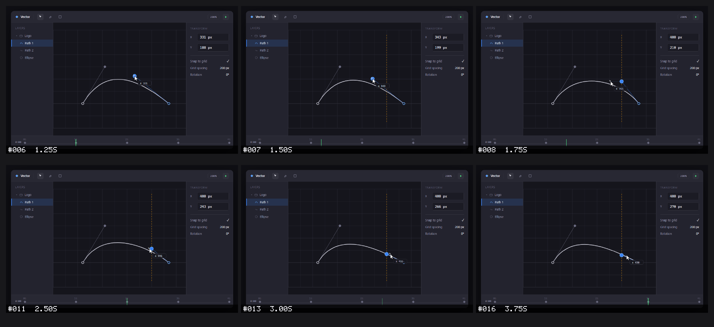

# Marey

**Give AI agents eyes for motion.**

A screenshot tells an agent what the screen *looks like*. Marey tells it what *changed*.

Marey is a [Model Context Protocol](https://modelcontextprotocol.io) server that turns a short screen interaction into a timestamped, agent-readable **contact sheet** — a grid of still frames an agent can inspect as a temporal sequence, with any frame retrievable at full resolution.

```bash
claude mcp add marey -- npx -y @anilyesilkaya/marey
```

That's the whole install. **Zero runtime dependencies**, nothing to clone.

---

## See it work

> **You:** "The control point sometimes jumps when I drag it in the easing editor. Can you figure out what's happening?"
>
> **Agent:** "Let me record the interaction with Marey." *(records while you reproduce the drag)*

Marey returns one image — the drag, decomposed into time:



> **Agent:** "The cursor moves continuously, but watch the inspector's **X** value. Through **#006 (1.25 s)** the control point tracks the cursor exactly — both read `x 331`. At **#007 (1.50 s)** a snap guide appears at the `400` gridline while the point is still tracking at `343`. One frame later, at **#008 (1.75 s)**, the point snaps to `X 400 px` while the cursor has only reached `355` — a ~45 px discontinuity. From there the cursor keeps gliding and by **#013 (3.00 s)** has *overtaken* the point (`415`), yet the point stays pinned at `400`. It isn't lagging — it's stuck to the line. Snapping is engaging too early; the snap threshold looks like it's being scaled by the 200% zoom, so it fires in canvas space instead of screen space. I'd check the snap-distance calculation."

A single screenshot would show *a* point and *a* cursor — and miss the jump entirely. The sequence makes the exact failing transition obvious, and the agent reads its diagnosis straight off the frames.

<sub>This is a real Marey contact sheet. Reproduce it with [`node demo/make-contactsheet.mjs`](demo/make-contactsheet.mjs), which renders the [bundled fixture](demo/jump-bug.html) and composes the frames with Marey's own contact-sheet code.</sub>

---

## Why Marey?

AI coding agents are good at understanding screenshots, but motion is still awkward. A bug such as:

- a control point jumping while it is dragged,
- a menu flashing and immediately closing,
- a canvas updating in the wrong order,
- an animation stuttering between states,

cannot be understood from a single screenshot. Marey bridges that gap: because it speaks MCP, the agent requests the recording itself and receives the resulting image directly in context.

No GIF inspection. No manually extracting frames. No dragging a dozen screenshots into chat.

It is named after [Étienne-Jules Marey](https://en.wikipedia.org/wiki/%C3%89tienne-Jules_Marey), a pioneer of **chronophotography** — the study of motion through sequences of images. Marey applies the same idea to AI agents: instead of handing a model a video it cannot reliably inspect frame by frame, it converts motion into a visual sequence the model can reason about.

---

## How it works

1. An MCP client asks Marey to record the screen.
2. Marey captures frames at a chosen frame rate.
3. Each frame is numbered and timestamped.
4. Marey composes the frames into a contact sheet.
5. The contact sheet is returned to the agent as MCP image content.
6. Raw frames remain available on disk for closer inspection or re-stitching.

The idea is deliberately simple:

**motion becomes one image containing time.**

---

## Tools

Marey exposes ten MCP tools:

| Tool | What it does |
| --- | --- |
| `record` | Records the screen for a **fixed duration** and returns a timestamped contact sheet |
| `start_recording` | Begins an **open-ended** recording the user controls |
| `stop_recording` | Stops the open-ended recording and returns the contact sheet |
| `capture` | Captures a single screenshot |
| `get_frame` | Returns one frame from a recording at **full resolution** |
| `list_windows` | Lists window IDs, titles, bounds, and hidden state |
| `observe` | Records until the user finishes through the local control page |
| `replay` | Keeps a rolling buffer and returns clips around user markers |
| `status` | Reports recording state |
| `get_frames` | Returns a contact sheet for a time range, with optional crop |

### `record`

| Parameter | Default | Description |
| --- | ---: | --- |
| `seconds` | `5` | Recording duration |
| `fps` | `15` | Target frames per second; achieved rate and gaps are reported |
| `region` | `primary` | `primary`, `virtual`, or `window` |
| `title` | — | Unambiguous visible window-title substring when `region` is `window` |
| `windowId` | — | Exact native window ID from `list_windows`; takes precedence over `title` |
| `rect` | — | `{x,y,w,h}` in target-relative pixels; restricts the captured source during recording |
| `delay` | `0` | Delay before capture begins |
| `detail` | `overview` | Legibility preset: `overview`, `high`, or `max` (see below) |
| `cols` | `4` | Number of thumbnails per contact-sheet row (overrides `detail`) |
| `thumbWidth` | `480` | Thumbnail width in pixels (overrides `detail`) |

The result contains:

- the contact sheet as MCP image content,
- a short text summary with capture metadata **and the full-resolution path of
  every frame**, so an agent can open the exact frame it needs,
- raw frames saved locally for later inspection.

#### Resolution and the `detail` preset

A single returned image has a fixed resolution budget, and a contact sheet
splits that budget across its columns. So legibility comes from **fewer, wider
cells** — not from `thumbWidth` alone (past a point, a large sheet is just
downscaled again by the client). The `detail` preset picks a sensible
columns/width pair:

| `detail` | Layout | Use when |
| --- | --- | --- |
| `overview` (default) | 4 cols · 480px | You want many frames at a glance |
| `high` | 2 cols · 760px | UI text / fine detail must be readable |
| `max` | 1 col · 1280px | You need the closest thing to the raw frame |

Two more levers when detail still falls short:

- **Capture a `window` instead of the full screen.** A 2560px desktop shrunk
  into a 480px thumbnail loses ~5× of its detail; an 800px window barely shrinks
  at all.
- **Open the raw frame.** Every frame is saved at full resolution under
  `captures/<timestamp>/`, and the `record` response lists each one's path.
  Reading a single raw frame is better than re-recording.

### `start_recording` / `stop_recording`

`record` is fixed-duration — the agent decides how long. When **you** control
the timing (you will drag something, open a menu, trigger an animation and the
duration is unpredictable), use the open-ended pair instead:

1. The agent calls `start_recording` on your cue (same parameters as `record`
   except `seconds`: `fps`, `region`, `title`/`windowId`, `rect`, `delay`, `detail`, `cols`,
   `thumbWidth`).
2. You perform the interaction.
3. The agent calls `stop_recording`, which composes and returns the contact
   sheet — identical output to `record`.

Only one recording may be active at a time. Frames are written to disk as they
are captured, and a safety cap stops a forgotten session before it grows without
bound.

### `capture`

Captures one frame immediately using the same region-selection semantics as `record`.

### `get_frame`

Returns a single frame from a prior recording at **full resolution**, as image
content over MCP. The contact sheet is a downscaled overview; when it is too
small to read fine detail, call `get_frame` with the recording directory and the
frame number (both listed in the `record` / `stop_recording` response), or a
direct frame path. Because the frame is returned through the protocol, this works
even for clients with no filesystem access.

### `list_windows`

Returns visible window titles, and geometry where available, so an agent can choose a target for window capture.

---

## Example

Once Marey is connected to an MCP client, interaction can be as simple as:

> Use Marey to record 6 seconds of my editor window at 4 fps with high detail while I drag an element, then tell me what changes between frames.

The agent receives the complete sequence as a single image and can reason about the transition rather than only the initial state. If any frame needs a closer look, the full-resolution originals are listed in the response and saved under `captures/`.

---

## Command-line use

Marey runs standalone from the repo — the easiest way to try the whole workflow,
including the interactive **observe** and **replay** modes, without wiring up an
MCP client. Clone it first (see [From source](#from-source)); every command is
`node src/cli.mjs <command>`.

**Diagnose capture** — confirm the backend actually works on this machine before
anything else:

```bash
node src/cli.mjs doctor                  # probe the backend with a REAL one-frame capture (pass/fail)
node src/cli.mjs backend                 # just name the detected backend
node src/cli.mjs windows                 # list targetable windows (hidden ones are flagged)
```

**Record a fixed clip** — you choose the duration up front:

```bash
node src/cli.mjs capture --region primary                                   # one frame
node src/cli.mjs record --seconds 4 --fps 4 --detail high                   # 4s of the screen
node src/cli.mjs record --region window --title "Chrome" --fps 4 --detail max  # just one window
```

**Capture an unpredictable moment** — when *you* control the timing:

```bash
# observe: a browser control page opens; reproduce the issue, then click Finish
# (or run `marey finish` from any terminal) and the same call returns the sheet.
node src/cli.mjs observe --fps 3 --detail high
node src/cli.mjs finish                  # ...from a second terminal, to end it

# replay: a rolling buffer always holds the last few seconds (a dashcam). Press
# Mark the instant something glitches; each mark becomes its own clip.
node src/cli.mjs replay --window-seconds 10 --fps 4
node src/cli.mjs mark                     # ...from a second terminal, to pin the look-back window
node src/cli.mjs finish                   # ...then end it — one contact sheet per mark
```

**Inspect a frame** — zoom into any frame at full resolution without re-recording:

```bash
node src/cli.mjs get-frame --dir captures/<timestamp> --index 7
node src/cli.mjs get-frame --dir captures/<timestamp> --index 7 \
  --normalized --crop-x 0.5 --crop-y 0 --crop-w 0.5 --crop-h 0.5   # top-right quadrant
```

Window capture grabs the window's **own surface** (via `PrintWindow`), so it
works even when the target is behind other windows. A minimized or off-screen
window has nothing to render, so Marey reports that rather than capturing junk —
restore the window (`node src/cli.mjs windows` flags which are hidden).

### Inspecting evidence quality and transitions

Recording results include requested and achieved FPS, mean spacing, maximum
frame gap, completion reason, warnings, errors, and the resolved target ID and
bounds. New MCP clients (protocol 2025-06-18 or later) also receive these as
`structuredContent`; older clients receive the same quality information as text.
Partial recordings remain inspectable and failed recordings return `isError:true`
alongside any available images. `stop_recording` retrieves evidence even if the
backend already stopped automatically.

A contact sheet selects neighborhoods around the strongest transitions: the
immediate **before**, **changed**, and **following** frames. Larger budgets also
retain the beginning and end of the recording. Small budgets favor transition
context over distant endpoints. Every stored frame is analyzed sequentially,
so analysis does not discard a brief event through preliminary time sampling.
Raw frames remain available even when the contact sheet must shrink.

Use `get_frames` to inspect a narrower time range together:

```text
get_frames { dir: "<recording dir>", startMs: 800, endMs: 1400, maxFrames: 12,
             crop: { normalized: true, x: 0.3, y: 0.2, w: 0.4, h: 0.5 } }
```

Times are inclusive acquisition timestamps in milliseconds. This returns one
budgeted contact sheet, the displayed frame indices/times, and source quality
metadata. It fails explicitly if no frames exist in the requested range.

For a smaller recording source (rather than an output-only crop), use:

```text
record { seconds: 2, fps: 20, region: "window", windowId: "<ID from list_windows>",
         rect: { x: 0, y: 0, w: 640, h: 480 }, detail: "high" }
```

Hidden windows are rejected. Ambiguous titles require an exact ID. Linux window
capture is a screen-rectangle grab and can be occluded; Windows uses the window's
own surface. Bounds describe target resolution at capture startup; frame metadata
includes actual dimensions when a window changes size.

CLI equivalents:

```bash
node src/cli.mjs record --seconds 2 --fps 20 --region window --window-id <id> \
  --rect-x 0 --rect-y 0 --rect-w 640 --rect-h 480
node src/cli.mjs get-frames --dir captures/<recording> --start-ms 800 --end-ms 1400 \
  --max-frames 12 --out /tmp/transition.png
```

### A note on frame rate

`fps` is the **target** rate (default **15**). A short event can still fall
between samples; an absent frame is not proof that a flicker did not occur.
Check **achieved FPS** and **maximum frame gap** before making timing claims.

X11 uses one persistent FFmpeg process when `ffmpeg` and `xdotool` are available.
macOS uses FFmpeg's AVFoundation screen input when available; Screen Recording
permission is required. Frames use acquisition PTS, not PNG arrival times. Windows
keeps its existing single PowerShell stream. Smaller capture rectangles reduce
encoding and transfer work; Windows window-surface capture must still render the
full window before cropping.

Wayland and hosts without a continuous backend use native single-frame commands,
scheduled against deadlines so capture/encoding time is not added to every frame
interval. Results explicitly report that fallback. Installing FFmpeg enables
continuous X11/macOS capture, but does not establish its achievable rate.

On Linux/X11 in development validation, a 320×240 capture reached 20 fps with
50ms frame gaps, and an isolated real-pixel test captured a 100ms flash. This is
a tested configuration, not a guarantee for other hosts or resolutions.

---

## Installation

### Requirements

- **Node.js 18+**
- A supported screen-capture backend

**Zero runtime dependencies.** Marey ships with an empty `dependencies` block —
`npm install` pulls nothing. Everything is built on Node builtins:

- **PNG decode/encode** — pure JavaScript over the builtin `zlib`
  ([`src/png.mjs`](src/png.mjs)); no `sharp`, `jimp`, or `pngjs`.
- **Thumbnails, compositing, and frame labels** — a pure-JS image buffer and a
  hand-coded 5×7 bitmap font ([`src/image.mjs`](src/image.mjs),
  [`src/font.mjs`](src/font.mjs)); no image or font library.
- **MCP protocol** — JSON-RPC 2.0 over stdio, hand-rolled
  ([`src/jsonrpc.mjs`](src/jsonrpc.mjs)); no MCP SDK.
- **Screen capture** — `child_process` driving the native or command-line
  backend available on the host ([`src/capture.mjs`](src/capture.mjs)).

`npx` fetches and runs Marey on demand, so there is nothing to install globally
and no path to configure.

---

## Connect to an MCP client

### Claude Code

```bash
claude mcp add marey -- npx -y @anilyesilkaya/marey
```

Verify with `claude mcp list` or `/mcp`.

### Claude Code plugin

The plugin bundles the MCP server **and** a skill that teaches Claude when and
how to use Marey for visual debugging:

```text
/plugin marketplace add anilyesilkaya/marey
/plugin install marey@marey
```

### Claude Desktop or another MCP client

Add Marey to the client's MCP configuration:

```json
{
  "mcpServers": {
    "marey": {
      "command": "npx",
      "args": ["-y", "@anilyesilkaya/marey"]
    }
  }
}
```

### From source

To hack on Marey, clone it and point your client at `src/server.mjs`:

```bash
git clone https://github.com/anilyesilkaya/marey.git
cd marey
claude mcp add marey -- node "$PWD/src/server.mjs"
```

---

## Capture backends

Marey auto-detects an available screen-capture backend.

| Platform | Full / monitor capture | Window capture |
| --- | --- | --- |
| Windows 10/11 | Built-in PowerShell + `System.Drawing` | Built-in |
| Linux · X11 | ImageMagick/scrot for screenshots; FFmpeg + xdotool for continuous capture | `ffmpeg` + `xdotool` + `xwininfo` |
| Linux · Wayland | `grim` | Compositor-dependent |
| macOS | Built-in `screencapture`; optional FFmpeg AVFoundation stream | Not yet supported |

On X11, window listing and validation use `xdotool` and `xwininfo`; `xrandr`
identifies the primary monitor when available. ImageMagick output is forced to
8-bit, non-interlaced RGB so monochrome screens remain decodable. Wayland supports
`virtual` capture or an explicit rectangle; it rejects window capture and cannot
infer a primary output. macOS supports `primary`/rectangles, not a virtual desktop.
Native Windows/macOS changes require validation on those platforms; the new
real-pixel regression is currently Linux/X11-only.

Run ordinary tests with `npm test`. For real X11 coverage, install `xvfb`, `ffmpeg`,
`imagemagick`, `xdotool`, `x11-utils`, `x11-xserver-utils`, and `x11-apps`, then run
`MAREY_NATIVE_TESTS=1 node --test test/native-capture.test.mjs`. It creates and
cleans up its own display. CI runs it separately from the portable tests.

---

## Output

Recordings are stored under `captures/`:

```text
captures/
└── 20260101-120000/
    ├── frame_001_00000ms.png
    ├── frame_002_00500ms.png
    ├── frame_003_01000ms.png
    └── contactsheet.png

captures/latest-contactsheet.png
```

The raw frames make it possible to generate a different contact-sheet layout without recording the interaction again.

---

## Design principles

**Agent-first**

Marey is an MCP server rather than just a screen-recording CLI. The agent can request the visual evidence it needs.

**Still images over video**

The output is intentionally model-friendly: a numbered, timestamped sequence of frames in one image.

**Small surface area**

A handful of tools cover the core workflow: record, capture, inspect.

**Cross-platform core**

Frame composition stays platform-independent while screen capture is delegated to the best backend available on the host.

**Zero dependencies**

The entire pipeline — PNG codec, image compositing, frame labelling, and the
MCP protocol itself — is built on Node builtins. Nothing is pulled from npm, so
there is no supply chain to audit, no install step beyond cloning, and no
version drift in third-party packages.

**Short, deterministic recordings**

Fixed duration and frame rate make captures reproducible and easy for agents to request. An optional delay gives the user time to focus the target window before recording starts.

---

## Why the name?

Étienne-Jules Marey used chronophotography to make motion visible by decomposing it into successive images.

**Marey does the same thing for AI agents.**

---

## License

MIT — see [LICENSE](LICENSE).
